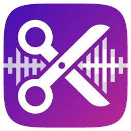

<div align="center">

# HookCut



**macOS app that uses AI to find the best highlights in podcast and video transcripts, then exports them as NLE-ready timelines**

[](https://swift.org)
[](https://www.apple.com/macos)
[](https://developer.apple.com/swiftui)
[](https://openai.com)
[](LICENSE)

</div>

---

## Features

- **AI Highlight Detection** -- GPT-4o or Claude analyzes full transcripts to find the best one-liners, cliffhangers, hot takes, emotional moments, quotable insights, and humor
- **Whisper Transcription** -- Extracts audio from video files and transcribes via OpenAI Whisper with word-level timestamps
- **Speaker Diarization** -- Identifies and labels individual speakers throughout the transcript
- **Prompt Templates** -- Built-in templates (Podcast Teaser, Best Quotes, Key Takeaways, Funny Moments, Controversial Takes) plus custom prompt support
- **Multi-Format Export** -- Export highlights as FCPXML (Final Cut Pro), Premiere XML, EDL, SRT subtitles, CSV, or plain text
- **Teaser Sequencing** -- AI suggests an optimal highlight playback order for maximum impact in teasers and trailers
- **Batch Processing** -- Queue multiple media files for sequential transcription and analysis
- **Video Preview** -- Built-in video player with highlight navigation for reviewing detected moments
- **Configurable Detection** -- Set highlight count, target duration, enabled types, and custom prompt additions
- **Dual AI Provider Support** -- Choose between OpenAI GPT-4o and Anthropic Claude with automatic fallback
- **Cost Estimation** -- Estimates API costs before processing

## Getting Started

### Prerequisites

- macOS 14 (Sonoma) or later
- [Swift 5.9+](https://swift.org/download/) and Xcode 15+
- An [OpenAI API key](https://platform.openai.com/api-keys) (for Whisper transcription and GPT-4o analysis)
- (Optional) An [Anthropic API key](https://console.anthropic.com/) for Claude-based highlight detection

### Build & Run

```bash
git clone https://github.com/markksantos/HookCut.git
cd HookCut
swift build
swift run HookCut
```

Or open the project in Xcode and press **Cmd + R**.

After launching, go to **Settings** and enter your API keys.

## Tech Stack

| Layer            | Technology                               |
| ---------------- | ---------------------------------------- |
| Language         | Swift 5.9                                |
| UI Framework     | SwiftUI (macOS 14+)                      |
| Transcription    | OpenAI Whisper API                       |
| Highlight AI     | OpenAI GPT-4o / Anthropic Claude         |
| Audio Pipeline   | AVFoundation (AudioExtractor)            |
| Export Formats   | FCPXML, Premiere XML, EDL, SRT, CSV, TXT |
| Build System     | Swift Package Manager                    |
| Persistence      | UserDefaults (settings)                  |

## Project Structure

```
HookCut/
├── Package.swift
└── HookCut/
    ├── HookCutApp.swift               # App entry point, AppState, SettingsManager, PromptTemplates
    ├── Models/
    │   └── SharedModels.swift          # TranscriptionResult, AnalysisResult, Highlight, Speaker, etc.
    ├── Pipeline/
    │   └── AudioExtractor.swift        # AVFoundation audio extraction from video files
    ├── Services/
    │   ├── APISession.swift            # Shared URLSession with rate-limit retry
    │   ├── CostEstimator.swift         # API cost estimation before processing
    │   ├── HighlightDetector.swift     # GPT-4o / Claude highlight detection with structured prompts
    │   ├── SpeakerDiarization.swift    # Speaker identification and labeling
    │   ├── TranscriptionService.swift  # Orchestrates extract -> transcribe -> diarize -> detect
    │   └── WhisperService.swift        # OpenAI Whisper API integration
    ├── ViewModels/
    │   └── AppViewModel.swift          # Main view model coordinating UI and services
    ├── Views/
    │   ├── ContentView.swift           # Main window layout
    │   ├── ImportView.swift            # File import / drag-and-drop
    │   ├── TranscriptView.swift        # Scrollable transcript with speaker labels
    │   ├── HighlightsPanel.swift       # Highlight list with ratings and types
    │   ├── VideoPlayerView.swift       # Built-in video preview with highlight navigation
    │   ├── ExportSheet.swift           # Export format selection and configuration
    │   ├── BatchView.swift             # Batch processing queue
    │   └── SettingsView.swift          # API keys, AI provider, highlight preferences
    └── Export/
        ├── ExportService.swift         # Export orchestration protocol implementation
        ├── FCPXMLGenerator.swift       # Final Cut Pro XML export
        ├── PremiereXMLGenerator.swift  # Adobe Premiere XML export
        ├── EDLGenerator.swift          # Edit Decision List export
        ├── SRTExporter.swift           # Subtitle export
        ├── CSVExporter.swift           # Spreadsheet export
        └── PlainTextExporter.swift     # Plain text export
```

## License

MIT &copy; 2025 Mark Santos
