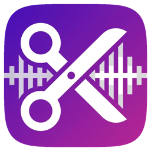

<div align="center">

# HookCut



**macOS app that uses AI to find the best highlights in podcast and video transcripts, then exports them as NLE-ready timelines**

[](https://swift.org)
[](https://www.apple.com/macos)
[](https://developer.apple.com/swiftui)
[](https://openai.com)
[](LICENSE)

</div>

---

## Features

- **AI Highlight Detection** -- GPT-4o, Claude, or a local Ollama model analyzes full transcripts to find the best one-liners, cliffhangers, hot takes, emotional moments, quotable insights, and humor
- **Cloud or On-Device Transcription** -- Transcribe with the OpenAI Whisper API, or run fully on-device with WhisperKit (CoreML / Neural Engine) — no key, no upload, no cost
- **Fully Local Mode** -- Pair on-device Whisper with a local Ollama model for an end-to-end pipeline that never touches the cloud
- **Whisper Transcription** -- Extracts audio from video files and transcribes with word-level timestamps; long files are automatically chunked and stitched
- **Speaker Diarization** -- Identifies and labels individual speakers throughout the transcript
- **Prompt Templates** -- Built-in templates (Podcast Teaser, Best Quotes, Key Takeaways, Funny Moments, Controversial Takes) plus custom prompt support
- **Multi-Format Export** -- Export highlights as FCPXML (Final Cut Pro), Premiere XML, EDL, SRT subtitles, CSV, or plain text
- **Teaser Sequencing** -- AI suggests an optimal highlight playback order for maximum impact in teasers and trailers
- **Batch Processing** -- Queue multiple media files, process them sequentially with per-item progress and cancellation, then **Export All** to a folder in one click
- **Video Preview** -- Built-in video player with highlight navigation and back-to-back "Preview All" of approved clips
- **Configurable Detection** -- Set highlight count, target duration, enabled types, and custom prompt additions
- **AI Provider Choice** -- OpenAI GPT-4o, Anthropic Claude, or local Ollama, with automatic OpenAI fallback when a Claude key is missing
- **Cost Estimation** -- Estimates API cost before processing (and shows $0 for fully-local runs)

## Getting Started

### Prerequisites

- macOS 14 (Sonoma) or later
- [Swift 5.9+](https://swift.org/download/) and Xcode 15+
- For the cloud path: an [OpenAI API key](https://platform.openai.com/api-keys) (Whisper transcription + GPT-4o analysis)
- (Optional) An [Anthropic API key](https://console.anthropic.com/) for Claude-based highlight detection
- (Optional) [Ollama](https://ollama.com/) running locally (`ollama serve`) for fully-local analysis — no API key required

### Build & Run

```bash
git clone https://github.com/markksantos/HookCut.git
cd HookCut
swift build
swift run HookCut
```

Or generate the Xcode project with [XcodeGen](https://github.com/yonaskolb/XcodeGen) and open it:

```bash
xcodegen generate
open HookCut.xcodeproj   # then press Cmd + R
```

After launching, the first-run welcome screen points you to **Settings (⌘,)**.
Pick your transcription engine (Cloud or On-Device) and AI provider, enter any
needed API keys, and you're ready to import a file.

### Tests

```bash
swift test
```

Covers the timecode math, every export format (including XML-escaping
correctness), and the cost estimator.

## Tech Stack

| Layer            | Technology                               |
| ---------------- | ---------------------------------------- |
| Language         | Swift 5.9                                       |
| UI Framework     | SwiftUI (macOS 14+)                             |
| Transcription    | OpenAI Whisper API or on-device WhisperKit      |
| Highlight AI     | OpenAI GPT-4o / Anthropic Claude / local Ollama |
| Audio Pipeline   | AVFoundation (AudioExtractor)                   |
| Export Formats   | FCPXML, Premiere XML, EDL, SRT, CSV, TXT        |
| Build System     | Swift Package Manager (XcodeGen for .xcodeproj) |
| Persistence      | UserDefaults (settings) + JSON session cache    |

## Project Structure

```
HookCut/
├── Package.swift
└── HookCut/
    ├── HookCutApp.swift               # App entry point, AppState, SettingsManager, PromptTemplates
    ├── Models/
    │   └── SharedModels.swift          # TranscriptionResult, AnalysisResult, Highlight, Speaker, etc.
    ├── Pipeline/
    │   └── AudioExtractor.swift        # AVFoundation audio extraction from video files
    ├── Services/
    │   ├── APISession.swift            # Shared URLSession with rate-limit retry
    │   ├── CostEstimator.swift         # API cost estimation before processing
    │   ├── HighlightDetector.swift     # GPT-4o / Claude highlight detection with structured prompts
    │   ├── SpeakerDiarization.swift    # Speaker identification and labeling
    │   ├── TranscriptionService.swift  # Orchestrates extract -> transcribe -> diarize -> detect
    │   ├── LocalWhisperService.swift   # On-device transcription via WhisperKit
    │   └── WhisperService.swift        # OpenAI Whisper API integration
    ├── ViewModels/
    │   └── AppViewModel.swift          # Main view model coordinating UI and services
    ├── Views/
    │   ├── ContentView.swift           # Main window layout
    │   ├── ImportView.swift            # File import / drag-and-drop
    │   ├── TranscriptView.swift        # Scrollable transcript with speaker labels
    │   ├── HighlightsPanel.swift       # Highlight list with ratings and types
    │   ├── VideoPlayerView.swift       # Built-in video preview with highlight navigation
    │   ├── ExportSheet.swift           # Export format selection and configuration
    │   ├── BatchView.swift             # Batch processing queue + Export All
    │   ├── WelcomeView.swift           # First-run onboarding screen
    │   └── SettingsView.swift          # API keys, AI provider, highlight preferences
    └── Export/
        ├── ExportService.swift         # Export orchestration protocol implementation
        ├── FCPXMLGenerator.swift       # Final Cut Pro XML export
        ├── PremiereXMLGenerator.swift  # Adobe Premiere XML export
        ├── EDLGenerator.swift          # Edit Decision List export
        ├── SRTExporter.swift           # Subtitle export
        ├── CSVExporter.swift           # Spreadsheet export
        └── PlainTextExporter.swift     # Plain text export
```

## Packaging & Distribution

A debug `.app` is produced by Xcode/XcodeGen builds. To ship a signed,
notarized `.dmg` you need an Apple Developer account and a Developer ID
Application certificate:

```bash
xcodebuild -project HookCut.xcodeproj -scheme HookCut -configuration Release \
  -derivedDataPath build \
  CODE_SIGN_IDENTITY="Developer ID Application: <Your Name> (<TEAMID>)" \
  build
# then: create-dmg / hdiutil, codesign --deep, notarytool submit, stapler staple
```

The app already ships hardened-runtime + App Sandbox entitlements
(`HookCut/HookCut.entitlements`) and a `PrivacyInfo.xcprivacy` manifest, so it's
ready for notarization and the Mac App Store once a signing identity is in place.

## License

MIT &copy; 2025 Mark Santos — see [LICENSE](LICENSE)
